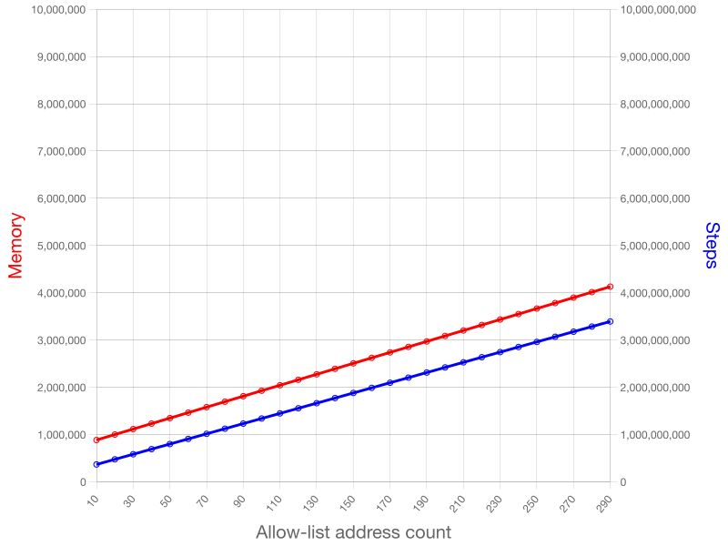
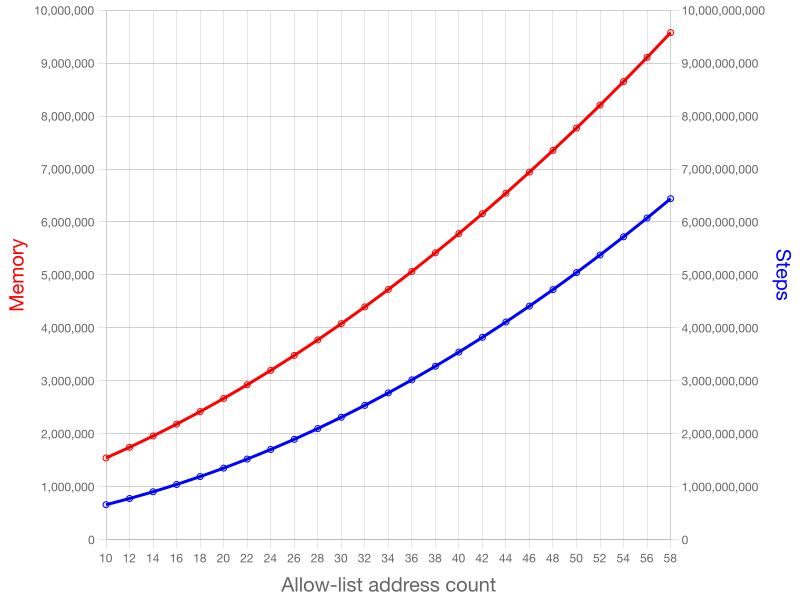
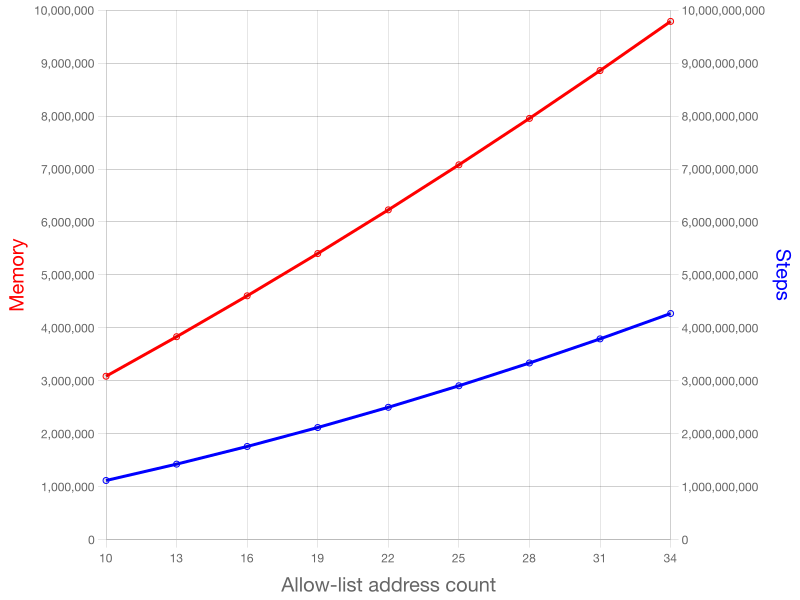

# Benchmark results

### Payout to a single address

If the vendor withdrawal is sent to 1 address of the allow-list, then even if it's in the last place
(the validator has to traverse the whole list), the allow-list upper bound should not be a limiting
factor.

### Payout to multiple addresses

In worst-case, all addresses in the allow list are used in the outputs and the validator has to iterate
through the allow-list multiple times.

### Multi-asset payout to multiple addresses

Other factors can contribute to the increase in execution units. In this test 3 asset classes are
distributed between multiple addresses.

### Payout of multiple outputs to the same address

If the output address is the last in the list and there are multiple outputs to the same address, we
could have worse results, but this scenario could be easily mitigated by merging these outputs.
